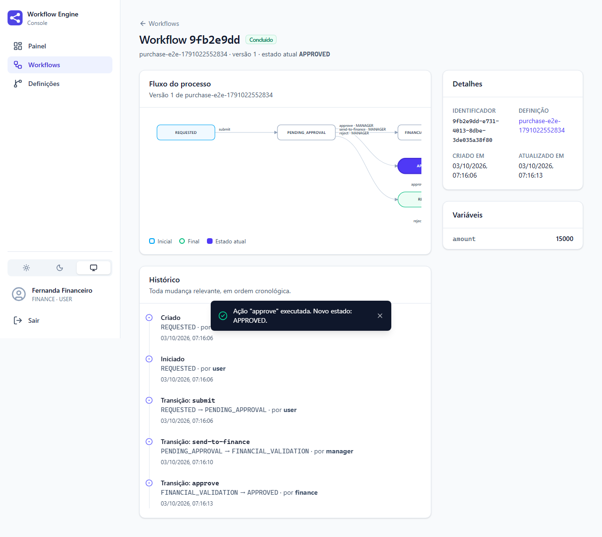
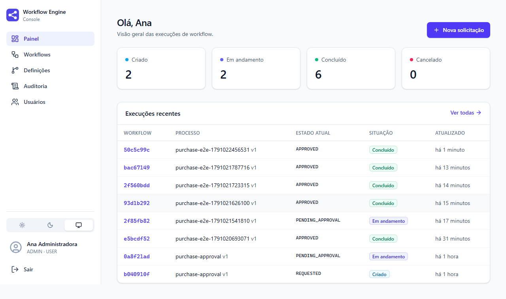
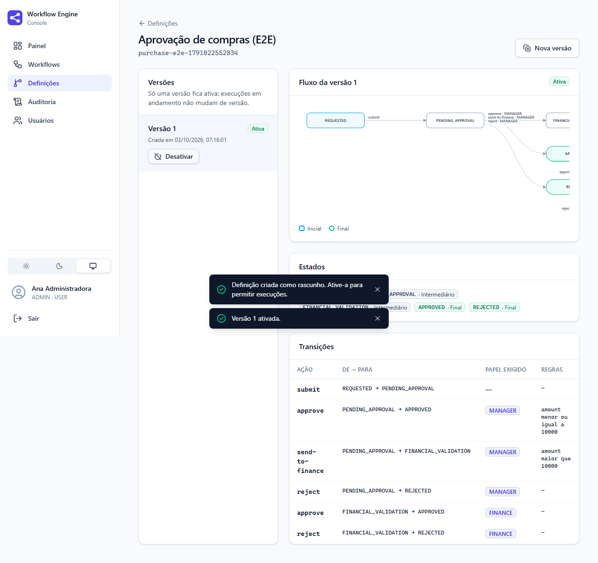
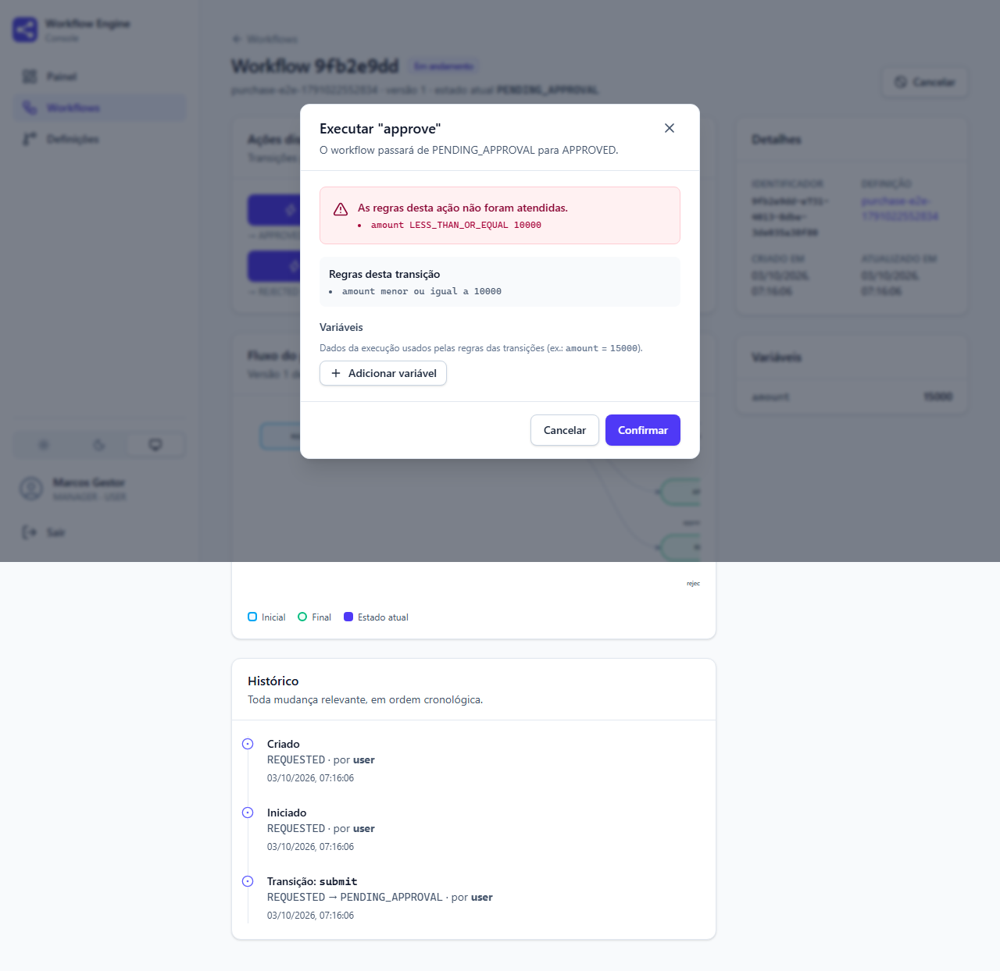
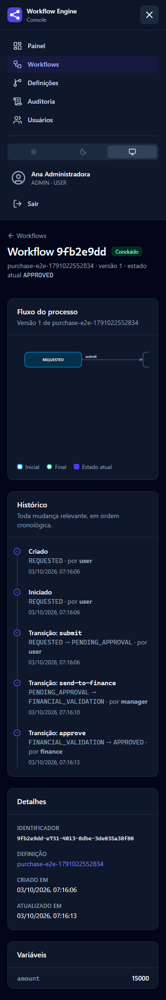

# 🚀 Enterprise Workflow Engine

> Plataforma para modelagem, execução e auditoria de workflows corporativos — API REST e console web.

[](../../actions/workflows/ci.yml)

## 📌 Visão Geral

O **Enterprise Workflow Engine** é um motor de workflow: transforma processos de negócio — aprovações,
solicitações, validações — em fluxos executáveis, versionados e auditáveis, operados por um console web
ou integrados por uma API REST.

Você descreve o processo (estados, transições, quem pode agir e sob quais condições) e o motor garante que
cada execução siga exatamente o que foi definido, registrando tudo o que acontece.

```text
REQUESTED ──submit──► PENDING_APPROVAL ──approve (MANAGER, amount ≤ 10000)──────────► APPROVED
                              │                                                          ▲
                              ├──send-to-finance (MANAGER, amount > 10000)──► FINANCIAL_VALIDATION
                              │                                                │         │
                              └──reject (MANAGER)──► REJECTED ◄──reject (FINANCE)        └─approve (FINANCE)
```



---

## ✨ O que o motor faz

| Capacidade                  | Descrição                                                                                      |
| --------------------------- | ---------------------------------------------------------------------------------------------- |
| **Definições versionadas**  | Cada alteração de processo é uma nova versão; execuções em andamento não mudam de versão       |
| **Validação estrutural**    | Recusa processos sem estado inicial, com estados inalcançáveis, becos sem saída ou ações ambíguas |
| **Execução controlada**     | Só acontecem transições previstas a partir do estado atual                                     |
| **Regras declarativas**     | Transições condicionadas a dados da execução (`amount > 10000`)                                |
| **Autorização por papel**   | Por endpoint e por transição                                                                   |
| **Histórico**               | O que aconteceu com cada workflow, em ordem cronológica                                        |
| **Auditoria**               | Quem fez o quê, quando e com qual resultado — inclusive tentativas recusadas                   |
| **Consistência**            | Uma transação por operação e controle de concorrência otimista                                 |
| **Console web**             | Modelar, ativar, solicitar, decidir, acompanhar e auditar pelo navegador; tema claro/escuro, celular, WCAG 2 AA |
| **Segurança**               | Sessão HttpOnly + CSRF, BCrypt, bloqueio por tentativas, revogação imediata, CSP, auditoria de acesso |

---

## ▶️ Como executar

**Para desenvolver** (JDK 25+ e Node 22+; **não precisa de Docker**):

```bash
./mvnw spring-boot:test-run                  # PostgreSQL embutido (:5433) + API em :8080, perfil local
cd frontend && npm install && npm run dev    # console em :5173, com proxy para a API
```

Abra **http://localhost:5173** e entre com uma das contas abaixo. O PostgreSQL embutido é baixado do Maven
Central e roda dentro da JVM. Os dados ficam em `.local/postgres` e persistem entre execuções; apague a
pasta para recomeçar do zero. Para usar outra porta, defina `LOCAL_DB_PORT`. Para usar um PostgreSQL
existente, defina `DB_URL`, `DB_USERNAME` e `DB_PASSWORD`. No Windows (cmd ou PowerShell), use `mvnw.cmd`.

**Tudo em containers** (opcional, com Docker):

```bash
docker compose --profile app up --build      # http://localhost:8080
```

| Recurso      | Endereço                                |
| ------------ | --------------------------------------- |
| Console web  | http://localhost:8080 (ou :5173 em desenvolvimento) |
| Swagger UI   | http://localhost:8080/swagger-ui.html   |
| Health check | http://localhost:8080/actuator/health   |

### Contas de demonstração (perfil `local`)

Todas com a senha **`workflow-demo-2026`**:

| Usuário   | Quem é                | Papéis            |
| --------- | --------------------- | ----------------- |
| `admin`   | Ana Administradora    | `ADMIN`, `USER`   |
| `manager` | Marcos Gestor         | `USER`, `MANAGER` |
| `finance` | Fernanda Financeiro   | `USER`, `FINANCE` |
| `user`    | Lucas Solicitante     | `USER`            |

Contas apenas para desenvolvimento. Em produção, o primeiro administrador vem do ambiente e os demais são
criados pelo console ([SECURITY.md](docs/architecture/SECURITY.md)).

---

## 🖥️ Console web

| | |
| --- | --- |
|  |  |
|  |  |

Pelo console, o roteiro de demonstração é:

1. **admin** → Definições → *Nova definição* → *Usar exemplo* → criar e **Ativar**;
2. **user** → *Nova solicitação* com `amount = 15000` → *Iniciar* → `submit`;
3. **manager** → `approve` é **recusado pela regra** (`amount ≤ 10000`) → `send-to-finance`;
4. **finance** → `approve` → workflow **Concluído**, com o histórico completo;
5. **admin** → Auditoria: todas as operações, inclusive a tentativa recusada.

---

## 🧪 Exemplo pela API

Integrações usam HTTP Basic (sem sessão nem CSRF):

```bash
API=http://localhost:8080/api/v1
PASS=workflow-demo-2026

# 1. O administrador define o processo (a versão 1 nasce como rascunho)
curl -u admin:$PASS -X POST $API/workflow-definitions -H "Content-Type: application/json" -d '{
  "key": "purchase-approval",
  "name": "Purchase Approval",
  "states": [
    {"name": "REQUESTED", "type": "INITIAL"},
    {"name": "PENDING_APPROVAL", "type": "INTERMEDIATE"},
    {"name": "FINANCIAL_VALIDATION", "type": "INTERMEDIATE"},
    {"name": "APPROVED", "type": "TERMINAL"},
    {"name": "REJECTED", "type": "TERMINAL"}
  ],
  "transitions": [
    {"action": "submit", "from": "REQUESTED", "to": "PENDING_APPROVAL"},
    {"action": "approve", "from": "PENDING_APPROVAL", "to": "APPROVED", "requiredRole": "MANAGER",
     "rules": [{"field": "amount", "operator": "LESS_THAN_OR_EQUAL", "value": "10000"}]},
    {"action": "send-to-finance", "from": "PENDING_APPROVAL", "to": "FINANCIAL_VALIDATION", "requiredRole": "MANAGER",
     "rules": [{"field": "amount", "operator": "GREATER_THAN", "value": "10000"}]},
    {"action": "reject", "from": "PENDING_APPROVAL", "to": "REJECTED", "requiredRole": "MANAGER"},
    {"action": "approve", "from": "FINANCIAL_VALIDATION", "to": "APPROVED", "requiredRole": "FINANCE"},
    {"action": "reject", "from": "FINANCIAL_VALIDATION", "to": "REJECTED", "requiredRole": "FINANCE"}
  ]
}'

# 2. ...e a disponibiliza para execução
curl -u admin:$PASS -X POST $API/workflow-definitions/purchase-approval/versions/1/activate

# 3. Um usuário cria e inicia uma solicitação de 15.000 (guarde o "id" da resposta)
curl -u user:$PASS -X POST $API/workflows -H "Content-Type: application/json" \
  -d '{"definitionKey": "purchase-approval", "variables": {"amount": 15000}}'
ID=<id retornado>
curl -u user:$PASS -X POST $API/workflows/$ID/start
curl -u user:$PASS -X POST $API/workflows/$ID/actions -H "Content-Type: application/json" -d '{"action": "submit"}'

# 4. O gestor tenta aprovar direto: recusado (422), a regra exige amount <= 10000
curl -u manager:$PASS -X POST $API/workflows/$ID/actions -H "Content-Type: application/json" -d '{"action": "approve"}'

# 5. O gestor encaminha ao financeiro, que aprova
curl -u manager:$PASS -X POST $API/workflows/$ID/actions -H "Content-Type: application/json" -d '{"action": "send-to-finance"}'
curl -u finance:$PASS -X POST $API/workflows/$ID/actions -H "Content-Type: application/json" -d '{"action": "approve"}'

# 6. O que aconteceu, e quem fez o quê (incluindo a tentativa recusada)
curl -u user:$PASS $API/workflows/$ID/history
curl -u admin:$PASS "$API/audit-records?resourceId=$ID"
```

Referência completa da API: [API_DESIGN.md](docs/architecture/API_DESIGN.md).

---

## 🧠 Arquitetura

**Modular Monolith + Clean Architecture**: uma única aplicação, organizada em módulos de negócio com
limites explícitos, cada um com suas camadas.

```text
com.pablohenrique.workflowengine
├── definition/      Workflow Definition — como o processo funciona
├── execution/       Workflow Execution  — o que acontece em cada execução
├── rules/           Rules               — esta operação pode ser realizada?
├── audit/           Audit               — quem fez o quê, quando e com qual resultado
├── identity/        Identity            — quem é o Actor e quais papéis tem
└── infrastructure/  segurança HTTP, erros, limites, hospedagem do console, OpenAPI

frontend/            Console web (React + TypeScript), servido pela aplicação na mesma origem

Dentro de cada módulo:
contract/  →  domain/  →  application/  →  infrastructure/  +  interfaces/rest/
```

- O **domínio é Java puro**: não conhece Spring, JPA nem HTTP, e é testado sem infraestrutura.
- Módulos só se comunicam por **contratos públicos** (`contract`).
- Esses limites são **verificados a cada build** por testes de arquitetura (ArchUnit).

Detalhes: [ARCHITECTURE.md](docs/architecture/ARCHITECTURE.md) ·
[MODULES.md](docs/architecture/MODULES.md) · [decisões em vigor](docs/architecture/DECISIONS.md) ·
[ADRs](docs/adr/README.md)

---

## 🛠️ Tecnologias

| Área            | Tecnologia                                              |
| --------------- | ------------------------------------------------------- |
| Linguagem       | Java 25                                                 |
| Framework       | Spring Boot 4.1 (Web MVC, Data JPA, Security, Actuator) |
| Banco de dados  | PostgreSQL 18, migrations com Flyway                    |
| API             | REST, OpenAPI (springdoc), Problem Details (RFC 9457)   |
| Testes          | JUnit, AssertJ, MockMvc, Testcontainers, Embedded PostgreSQL, ArchUnit |
| Qualidade       | JaCoCo (mínimo de 80% de linhas em CI)                  |
| Console web     | React 19, TypeScript, Vite, TanStack Query, React Router, Tailwind CSS 4 |
| Testes do console | Vitest, Testing Library, Playwright, axe (acessibilidade) |
| Segurança       | Spring Security (sessão JDBC, CSRF, BCrypt), CodeQL, Dependabot |
| Infraestrutura  | Docker, Docker Compose, GitHub Actions                  |

---

## ✅ Testes

```bash
./mvnw verify
```

Executa testes unitários de domínio, testes de arquitetura e testes de integração (API, segurança e
PostgreSQL reais), e gera o relatório de cobertura em `target/site/jacoco/index.html`.

Os testes de integração rodam sempre, sem nenhuma instalação. Se houver Docker (como no CI), usam um
container via Testcontainers; senão, usam um PostgreSQL 18 embutido. Para forçar o embutido mesmo com
Docker, defina `EWE_TEST_DB=embedded`. Para usar um banco existente e descartável, defina `EWE_TEST_DB_URL`,
`EWE_TEST_DB_USERNAME` e `EWE_TEST_DB_PASSWORD`.

Console:

```bash
cd frontend
npm run lint && npm run typecheck && npm test    # estáticos e unitários
npm run e2e                                      # navegador real contra a aplicação (ver TEST_STRATEGY)
```

Detalhes: [TEST_STRATEGY.md](docs/quality/TEST_STRATEGY.md).

---

## 📚 Documentação

| Área         | Documentos                                                                                              |
| ------------ | ------------------------------------------------------------------------------------------------------- |
| Produto      | [Visão](docs/product/VISION.md) · [Domínio](docs/product/DOMAIN.md) · [Requisitos](docs/product/REQUIREMENTS.md) · [Casos de uso](docs/product/USE_CASES.md) · [Regras de negócio](docs/product/BUSINESS_RULES.md) |
| Status       | [Backend](docs/backend-status.md) · [Console](docs/frontend-status.md) |
| Arquitetura  | [Arquitetura](docs/architecture/ARCHITECTURE.md) · [Módulos](docs/architecture/MODULES.md) · [Modelo de dados](docs/architecture/DATA_MODEL.md) · [API](docs/architecture/API_DESIGN.md) · [Segurança](docs/architecture/SECURITY.md) · [Deployment](docs/architecture/DEPLOYMENT.md) |
| Decisões     | [ADRs](docs/adr/README.md) · [Decisões em vigor](docs/architecture/DECISIONS.md) · [Log de decisões](docs/quality/DECISION_LOG.md) |
| Qualidade    | [Estratégia de testes](docs/quality/TEST_STRATEGY.md) · [Padrões de código](docs/quality/CODE_STANDARDS.md) · [Definition of Done](docs/quality/DEFINITION_OF_DONE.md) · [Checklists](docs/quality/CHECKLISTS.md) |
| Evolução     | [Roadmap](docs/product/ROADMAP.md) · [Backlog técnico](docs/product/TECHNICAL_BACKLOG.md) · [Dívida técnica](docs/releases/TECHNICAL_DEBT.md) · [Changelog](docs/releases/CHANGELOG.md) · [Versionamento](docs/releases/VERSIONING.md) |
| Governança   | [Project Governance](docs/PROJECT_GOVERNANCE.md)                                                        |

---

## 📍 Status do Projeto

🚧 **Em desenvolvimento** — versão `0.1.0` implementada, aguardando validação e publicação.

| Milestone                       | Status                         |
| ------------------------------- | ------------------------------ |
| 0 — Foundation                  | 🟢 Concluído                   |
| 1 — Product Definition          | 🟢 Concluído                   |
| 2 — Architecture Foundation     | 🟡 Implementado, em validação  |
| 3 — Workflow Engine Core        | 🟡 Implementado, em validação  |
| 4 — Enterprise Features         | 🟡 Parcial                     |
| 5 — Production Ready            | 🟡 Parcial                     |

Próximos passos: login por OIDC com MFA e SSO, transições automáticas, eventos de domínio e operação
(métricas, tracing, deployment). Veja o [Roadmap](docs/product/ROADMAP.md) e as
[limitações conhecidas](docs/releases/TECHNICAL_DEBT.md).

---

## 🎯 Objetivo do Projeto

Demonstrar, em um sistema completo, práticas de engenharia backend usadas em ambientes corporativos:
arquitetura modular, Domain-Driven Design, Clean Architecture, APIs REST, persistência, segurança, testes
automatizados, observabilidade, containers e CI — com decisões registradas e justificadas.

O projeto é construído de forma incremental: cada etapa é planejada, implementada, validada e documentada
antes da seguinte, conforme o [modelo de governança](docs/PROJECT_GOVERNANCE.md).

---

## 👨‍💻 Motivação

O Enterprise Workflow Engine faz parte de uma jornada de desenvolvimento profissional focada em arquitetura
backend e construção de sistemas corporativos.

> Desenvolvimento de plataformas backend escaláveis orientadas a processos de negócio.

---

## 📄 Licença

Projeto desenvolvido para fins de estudo, evolução profissional e demonstração de habilidades técnicas.
